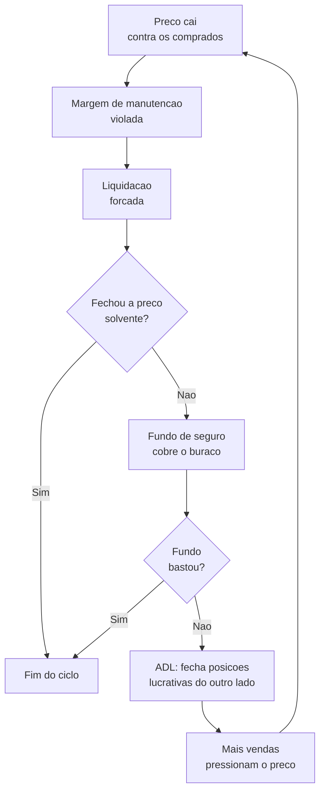
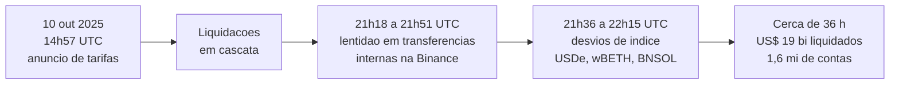

# Capítulo 51: Futuros Perpétuos, Liquidações em Cascata e o 10 de Outubro de 2025

Nesta semana, o mercado voltou a falar de uma data: 10 de outubro. Em 2025, nesse dia, uma sequência de liquidações forçadas apagou algo na casa de 19 bilhões de dólares em posições alavancadas em poucas horas, o que a imprensa especializada descreve como a maior liquidação da história das criptomoedas. Na primeira semana de outubro de 2026, o ETH recuou para a faixa de 2.600 dólares e cerca de 400 milhões de dólares em posições compradas foram liquidados em questão de minutos, segundo relatos de imprensa, e o aniversário do episódio voltou ao noticiário. Este capítulo não trata de preço. Trata do mecanismo: o que é um contrato perpétuo, como funciona uma liquidação, por que ela pode virar cascata e o que o episódio de 2025 ensina sobre risco. Os capítulos 12 e 25 já mostraram liquidação e oráculos no mundo DeFi; aqui o foco são as corretoras de derivativos, onde a maior parte da alavancagem do mercado vive.

**O que é um contrato perpétuo.** Um futuro tradicional tem data de vencimento, e perto dela o preço do contrato converge para o preço à vista. O perpétuo não vence. Ele é um contrato de aposta alavancada sobre o preço de um ativo, que pode ser mantido aberto por tempo indeterminado. Sem vencimento, falta uma força que prenda o preço do contrato ao preço à vista, e o mecanismo que faz esse papel é a taxa de financiamento (funding rate): em intervalos regulares, tipicamente de 8 horas nas grandes corretoras, quem está de um lado paga ao outro lado. Quando o contrato negocia acima do preço à vista, os comprados pagam aos vendidos; quando negocia abaixo, ocorre o inverso. Os detalhes da fórmula variam de corretora para corretora, então vale ler a documentação de cada uma.

**Margem, alavancagem e preço de liquidação.** Para abrir uma posição, o operador deposita uma margem inicial. Para mantê-la aberta, precisa de uma margem de manutenção. Se o prejuízo corrói o saldo até esse piso, a corretora fecha a posição à força, e isso é a liquidação. Quanto maior a alavancagem, menor a folga: com alavancagem de 100 vezes, um movimento de 1% contra a posição consome toda a margem. Para evitar que um pico momentâneo de preço numa única praça liquide alguém injustamente, as corretoras costumam basear a liquidação no preço de referência (mark price), uma média que combina vários mercados à vista, e não no último negócio executado. Esse detalhe será importante adiante.

```latex
Distancia ate a liquidacao (aprox.) = 1 / alavancagem

Alavancagem 10x  -> movimento adverso de cerca de 10% zera a margem
Alavancagem 100x -> movimento adverso de cerca de 1% zera a margem
```

A relação acima é uma simplificação, porque ignora taxas, financiamento e a margem de manutenção, mas dá a ordem de grandeza do problema.

**A cadeia de proteção: liquidação, fundo de seguro e ADL.** Quando uma posição é liquidada a um preço pior do que o de falência, sobra um prejuízo que alguém precisa absorver. A corretora tem, em geral, três camadas para isso, na ordem em que entram em ação.


*O ciclo de liquidação: se o fundo de seguro se esgota, o desalavancamento automático (ADL) fecha posições lucrativas da contraparte, e as vendas adicionais podem empurrar o preço e alimentar novas liquidações.*

O fundo de seguro é um colchão de dinheiro da própria corretora, formado em boa parte por sobras de liquidações bem-sucedidas. Se ele acaba, entra o desalavancamento automático (auto-deleveraging, ou ADL): a corretora escolhe posições lucrativas do lado oposto, geralmente as mais lucrativas e mais alavancadas, e as encerra ao preço de falência da posição quebrada. Na prática, quem apostou na direção certa pode ter a posição fechada contra a vontade e perder o ganho que ainda esperava. Na Hyperliquid, corretora descentralizada de perpétuos, a documentação descreve uma ordem parecida, com o cofre de liquidez do protocolo (HLP) absorvendo perdas primeiro, depois o fundo de seguro e, por último, o ADL.

**O que aconteceu em 10 de outubro de 2025.** O gatilho foi macroeconômico. Às 14h57 UTC, segundo os relatos, o presidente dos Estados Unidos anunciou tarifas de 100% sobre importações da China, e a notícia se somou a controles chineses sobre exportação de terras raras. O mercado de cripto vinha com muita alavancagem comprada: estimativas indicam que cerca de 87% das posições liquidadas eram compradas. Ao longo de cerca de 36 horas, algo em torno de 19 bilhões de dólares em posições foi liquidado e cerca de 1,6 milhão de contas foi atingido. A CoinShares registrou queda de 12,2% do ETH, até a mínima de 3.436,29 dólares, e o Bitcoin chegou perto de 104.800 dólares, mais de 14% abaixo da máxima da sexta-feira. Em volume de liquidações, a CoinShares chama o episódio de nove vezes maior que o de fevereiro de 2025 e dezenove vezes maior que o do colapso da FTX. No mercado de perpétuos como um todo, uma estimativa aponta recuo do interesse em aberto de cerca de 217 bilhões para 123 bilhões de dólares. Os números exatos variam conforme a fonte e a janela de medição, então valem como ordem de grandeza.


*Linha do tempo resumida do episódio, com os horários que a própria Binance divulgou em seu relatório posterior.*

**A disputa sobre a causa.** Aqui vale separar fato de interpretação. Em seu relatório posterior, a Binance sustentou que a onda foi causada principalmente pelo choque macroeconômico e por controles de risco de todo o mercado, e que cerca de 75% das liquidações do setor já tinham ocorrido antes de dois problemas localizados na plataforma: uma lentidão no sistema de transferências internas entre contas e desvios temporários no preço de índice de USDe, wBETH e BNSOL. Críticos discordam. Houve relatos de que o USDe, a stablecoin sintética da Ethena (um parente distante das estratégias do Capítulo 15), chegou a cotar perto de 0,62 dólar dentro da corretora, enquanto negociava muito perto de 1 dólar em outros lugares. Isso aponta para um problema de oráculo interno: se o preço de referência de uma corretora vem de um livro de ordens raso dela mesma, a liquidação de colateral pode seguir um preço que o resto do mundo não pratica (a mesma classe de risco do Capítulo 25). A própria Binance publicou análise sobre uma falha de seu oráculo e reembolsou usuários, com valores que variam entre as fontes, de 283 milhões a mais de 328 milhões de dólares. Há também relatos de ativos como ATOM e ENJ cotando perto de zero por instantes em livros finos. O quanto cada fator pesou continua em debate, e várias das fontes são corretoras concorrentes ou comentaristas com interesse.

| Camada | Quem a controla | Risco principal | Exemplo no episódio |
| --- | --- | --- | --- |
| Gatilho | Mercado e política | Choque que atinge todos de uma vez | Tarifas e terras raras |
| Alavancagem | Operadores e corretoras | Pouca folga com 50x a 100x | Cerca de 87% de liquidados comprados |
| Preço de referência | Corretora | Livro raso vira oráculo | Desvio de USDe, wBETH e BNSOL |
| Colchão de perdas | Corretora ou protocolo | Fundo de seguro esgotado | ADL sobre posições lucrativas |
| Infraestrutura | Corretora | Sistema lento na hora crítica | Saldos zerados na tela, transferências lentas |

*Cada camada do sistema de perpétuos tem um responsável e um modo de falha próprio; uma cascata costuma envolver várias delas ao mesmo tempo.*

**Por que isso importa para o ecossistema Ethereum.** O ETH é uma das moedas mais negociadas em perpétuos, e a camada de derivativos influencia o preço à vista por mecanismos diretos: liquidações de comprados viram vendas forçadas. Há ainda o caminho DeFi, em que colateral em queda dispara liquidações em protocolos de empréstimo (Capítulo 12), e as vendas desse colateral se somam à pressão. As corretoras descentralizadas de perpétuos, como a Hyperliquid, mostram que o modelo também existe on-chain, mas o episódio de 2025 deixou claro que descentralizar a custódia não elimina o problema de desenho: em um mercado de livro fino, a cadeia de liquidação e o ADL decidem quem paga a conta. Convém lembrar que a lógica de fluxos institucionais do Capítulo 13 atua em outro compartimento, o do mercado à vista, e não substitui esta análise. Aqui também não há recomendação de compra, venda ou de uso de alavancagem; o objetivo é entender o mecanismo.

**Perguntas práticas para ler um mercado alavancado.** Quanta alavancagem existe no sistema e de que lado ela está concentrada? O preço de liquidação usa um índice amplo ou o livro de uma única praça? O que acontece quando o fundo de seguro acaba, e o ADL está descrito de forma pública antes da crise? O colateral aceito é volátil ou pode se desacoplar, como uma stablecoin sintética (Capítulos 14 e 15)? A corretora garante que as transferências e o painel continuem funcionando sob estresse? Essas perguntas valem para qualquer plataforma, centralizada ou não, e são mais úteis lidas antes do dia ruim do que depois dele.

**Glossário do capítulo.**

- **Contrato perpétuo**: derivativo alavancado sem data de vencimento, cujo preço é mantido próximo do preço à vista pela taxa de financiamento.
- **Taxa de financiamento (funding rate)**: pagamento periódico entre compradores e vendedores que pressiona o preço do perpétuo em direção ao preço à vista.
- **Margem de manutenção**: patrimônio mínimo que uma posição precisa manter para não ser liquidada.
- **Liquidação**: fechamento forçado de uma posição quando a margem cai abaixo do mínimo exigido.
- **Preço de referência (mark price)**: preço composto, em geral por vários mercados, usado para decidir liquidações no lugar do último negócio.
- **Fundo de seguro**: reserva da corretora que cobre prejuízos de liquidações feitas a preço pior que o de falência.
- **Desalavancamento automático (ADL)**: mecanismo que encerra posições lucrativas do lado oposto quando o fundo de seguro não basta.
- **Interesse em aberto (open interest)**: valor total de contratos de derivativos ainda abertos.
- **Cascata de liquidações**: sequência em que vendas forçadas derrubam o preço e disparam novas liquidações.

**Fontes.**

Consultadas por resultados de busca (os sites não puderam ser abertos diretamente no ambiente de pesquisa, então valem como relato de imprensa e de análise de mercado; cifras divergem entre elas e devem ser confirmadas nos relatórios originais da Binance e da CoinShares):

- [Crypto's Worst Day Turns One: 5 Signals That Could Decide Whether 10/10 Happens Again, CCN](https://ccn.com/education/crypto/crypto-october-10-crash-anniversary-2026-liquidation-risk)
- [What Is October 10th? Crypto's 10/10 Mass Market Liquidation Event, CoinGecko](https://www.coingecko.com/learn/october-10-crypto-crash-explained)
- [Billions in liquidations: what happened?, CoinShares](https://etp.coinshares.com/insights/knowledge/billions-in-liquidations-what-happened/)
- [Crypto Crash Oct 2025: Leverage Meets Liquidity, FTI Consulting](https://www.fticonsulting.com/insights/articles/crypto-crash-october-2025-leverage-met-liquidity)
- [Binance says macro shock, not exchange failure, drove October's $19B liquidation cascade, AMBCrypto](https://ambcrypto.com/binance-says-macro-shock-not-exchange-failure-drove-octobers-19b-liquidation-cascade/)
- [The Ultimate 10/10 Crash Autopsy, The Defiant](https://thedefiant.io/newsletter/defi-daily/the-ultimate-10-10-crash-autopsy)
- [Crypto market update October 2025, RockawayX](https://rockawayx.com/insights/crypto-market-update-october-2025)
- [October 10: Who's to Blame for Crypto's $19 Billion Crash?, bit.com](https://www.bit.com/knowledge-hub/october-10-crypto-crash-binance-usde)
- [Perpetual Futures, glossário Spark](https://www.spark.money/glossary/perpetual-futures)
- [Mark price, glossário Spark](https://www.spark.money/glossary/mark-price)
- [Ethereum Price Analysis October 8, 2026, usethebitcoin](https://usethebitcoin.com/eth/ethereum-price-october-8-2026)
