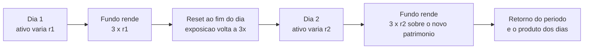

# Capítulo 52: ETFs Alavancados de ETH, Reset Diário e o Arrasto da Volatilidade

Na semana passada, o mercado de produtos listados em bolsa ganhou uma novidade que mistura dois temas já vistos no caderno: o apetite por alavancagem do Capítulo 51 e a entrada institucional do Capítulo 13. Segundo a imprensa especializada, em 2 de outubro de 2026 a SEC, o regulador do mercado de capitais dos Estados Unidos, aprovou uma mudança de regra da bolsa Cboe BZX que permite à Volatility Shares listar seis fundos que buscam três vezes o movimento diário de Bitcoin, Ether, ouro, prata, petróleo e gás natural. Os relatos indicam que a negociação ainda não começou e que faltam etapas de registro. Este capítulo não comenta preço nem recomenda nada. O objetivo é entender por que um fundo que promete "3x" não entrega três vezes o resultado de quem segura o ativo por mais de um dia, e isso é pura matemática.

**O que foi aprovado, e o que não foi.** Os relatos descrevem os fundos como veículos baseados em contratos futuros, com exposição a contratos do primeiro e do segundo mês e caixa como garantia. A SEC os classifica como produtos negociados em bolsa lastreados em commodities, e não como fundos de investimento convencionais da Lei de 1940. A razão do pedido separado é técnica: os padrões genéricos de listagem da Cboe permitem que alguns fundos de commodities entrem sem aprovação individual, mas excluem produtos alavancados. Um dos relatos cita ETHK como código do fundo de Ether no registro, mas, como a negociação não começou, convém tratar esse dado como provisório. A diferença em relação aos ETFs de ETH do Capítulo 13 é grande: aqueles guardam o ativo (ETFs à vista), enquanto estes operam com derivativos e prometem um múltiplo do retorno de um dia.

**Por que o 3x era raro.** Fundos registrados na Lei de 1940 seguem a Regra 18f-4, que limita o risco de derivativos por meio de um teste de valor em risco: em geral, o risco do fundo não pode passar de 200% do risco de sua carteira de referência. Na prática, isso limita o retorno diário perseguido por esses fundos a cerca de 2x o do índice. Fundos que já existiam antes da regra tiveram exceções, e é por isso que alguns 3x seguem negociando. Em dezembro de 2025, segundo os relatos, a SEC enviou nove cartas de advertência a emissores como Direxion, ProShares e Tidal, questionando o uso de carteiras de referência alternativas que reduziriam o risco aparente de produtos com alavancagem de 3x ou 5x. Um relato menciona ainda um pedido, em março de 2026, para evitar produtos de 5x. A aprovação de outubro de 2026 percorre outro caminho: como os fundos são estruturados como produtos de commodities, e não como fundos da Lei de 1940, a discussão passa pela regra de listagem da bolsa. Detalhes jurídicos como esse devem ser conferidos na ordem da SEC, que não pude abrir diretamente.

**A promessa é diária.** O ponto central é a frase que aparece em todo material regulatório sobre o tema: esses fundos são desenhados para atingir o objetivo em um único dia. A SEC, em seu boletim ao investidor atualizado em 2023, e a FINRA, em aviso de 2009, alertam que o desempenho em períodos maiores pode divergir de forma significativa do múltiplo diário. O mecanismo é o reset diário: ao fim de cada pregão, o fundo reajusta a exposição para voltar a ser 3 vezes o seu patrimônio daquele momento. Se o ativo sobe, o fundo precisa comprar mais; se cai, precisa vender, sempre ao fim do dia.


*Cada dia recomeça do patrimônio do dia anterior; o resultado de vários dias é a multiplicação das variações diárias, não três vezes a variação total.*

**A conta que importa.** Seja L o fator de alavancagem. Se o ativo tem retornos diários r1, r2 e assim por diante, o valor do fundo depois de T dias é dado por um produto.

```latex
Valor do fundo = V0 x (1 + L*r1) x (1 + L*r2) x ... x (1 + L*rT)

Aproximacao em regime de variacao continua (movimento browniano geometrico):
Crescimento logaritmico do ativo       = mu - sigma^2 / 2
Crescimento logaritmico do fundo (L x) = L*mu - L^2 * sigma^2 / 2
Diferenca em relacao a "L vezes o ativo" = - (L^2 - L) * sigma^2 / 2
Para L = 3 a diferenca e - 3 * sigma^2 por unidade de tempo
```

O termo sigma ao quadrado é a variância dos retornos. Quanto mais o ativo balança, maior o arrasto, e ele cresce com o quadrado da alavancagem. É a aproximação de um modelo simplificado, serve para dar ordem de grandeza e não para prever resultados reais, que dependem de custos, do custo de rolagem dos futuros e do caminho exato dos preços.

**Um exemplo com números redondos.** Considere um ativo que sobe 10% num dia e cai 10% no dia seguinte. O ativo vai de 100 para 110 e depois para 99, perda de 1%. Um fundo 3x sobe 30% (de 100 para 130) e depois cai 30% (de 130 para 91), perda de 9%. Três vezes a perda do ativo seria 3%, mas a perda foi de 9%. O ativo voltou quase ao ponto de partida; o fundo, não.

| Cenário em dois dias | Ativo | Fundo 3x | 3 vezes o ativo |
| --- | --- | --- | --- |
| +10% e depois -10% | 100 → 110 → 99 (-1%) | 100 → 130 → 91 (-9%) | -3% |
| -10% e depois +10% | 100 → 90 → 99 (-1%) | 100 → 70 → 91 (-9%) | -3% |
| +10% e +10% | 100 → 110 → 121 (+21%) | 100 → 130 → 169 (+69%) | +63% |
| -10% e -10% | 100 → 90 → 81 (-19%) | 100 → 70 → 49 (-51%) | -57% |

*A ordem dos dias muda pouco no empate, mas a oscilação sempre cobra um preço; em tendências firmes o efeito composto pode até favorecer o fundo, o que também é divergência do 3x simples.*

Note a terceira linha: numa tendência de alta sem oscilação, o fundo rende mais do que 3 vezes (69% contra 63%). A divergência vai nas duas direções, e o arrasto é o efeito dominante quando o mercado vai e volta. Isso conecta com a natureza do ETH, ativo de volatilidade alta, como se viu no Capítulo 51: em um dia de queda forte, o risco deixa de ser apenas arrasto.

**O limite de um dia ruim.** Num fundo 3x, uma queda de 33,3% do ativo em um único dia leva o valor do fundo a zero, porque 3 vezes 33,3% é 100%. Os futuros usados para montar a exposição, e a forma como a gestora reage em dias extremos, fazem parte do prospecto de cada fundo. Quedas diárias de ordem parecida são raras no ETH, mas movimentos de dois dígitos em um dia já ocorreram, e basta lembrar o episódio de outubro de 2025. Os documentos reguladores costumam alertar também que fundos desse tipo são em geral inadequados para quem pretende manter a posição além de uma sessão de negociação.

**Onde isso se encaixa no caderno.** Os capítulos anteriores mostraram três camadas de acesso ao ETH: o ativo em carteira (Capítulo 26), o ETF à vista que guarda o ETH e fecha custódia, criação e resgate (Capítulo 13), e os perpétuos, em que a alavancagem é explícita e a liquidação é do próprio operador (Capítulo 51). O ETF alavancado é uma quarta camada: a alavancagem fica embutida no produto, e quem compra não vê margem nem preço de liquidação, mas paga o custo no reset diário. O que muda é quem faz a gestão do risco, e não a natureza dele. Este capítulo não é recomendação de compra ou de venda de nenhum produto.

**Perguntas para ler o prospecto.** Antes de entender um produto assim, vale responder: qual é o objetivo declarado (diário ou de prazo maior)? Que instrumentos geram a exposição (futuros do primeiro e segundo mês, swaps)? Como a rolagem dos contratos afeta o retorno? Qual o custo anual? O que acontece em um dia de queda extrema? E a estrutura jurídica: é um fundo da Lei de 1940 ou um produto de commodity, e que proteções cada uma oferece?

**Glossário do capítulo.**

- **ETF alavancado**: fundo negociado em bolsa que busca um múltiplo (como 2x ou 3x) do retorno diário de um ativo ou índice.
- **Reset diário**: reajuste feito ao fim de cada pregão para que a exposição volte ao múltiplo prometido sobre o patrimônio do dia.
- **Arrasto da volatilidade**: perda de retorno composto causada pela oscilação dos preços, que cresce com a variância e com o quadrado da alavancagem.
- **Regra 18f-4**: norma da SEC que limita o uso de derivativos por fundos registrados, usando um teste de valor em risco.
- **Valor em risco (VaR)**: estimativa de perda potencial em um horizonte e com um nível de confiança definidos.
- **Carteira de referência**: portfólio usado como régua para medir o risco de um fundo no teste de valor em risco.
- **Contrato futuro**: acordo para comprar ou vender um ativo em data futura a preço combinado, usado aqui para montar a exposição sem guardar o ativo.
- **Rolagem**: troca de um contrato futuro prestes a vencer por outro de vencimento mais longo.
- **Retorno composto**: resultado de multiplicar as variações de cada período, em vez de somá-las.
- **Produto de commodity (ETP)**: veículo listado cujo lastro são commodities ou seus derivativos, fora do regime dos fundos de investimento convencionais.

**Fontes.**

As páginas abaixo foram consultadas por meio de buscas na web. As tentativas de abrir diretamente as páginas da SEC, da FINRA e dos sites de notícias foram bloqueadas pelo ambiente de execução, então os dados dessas fontes vêm dos resumos de busca; os números do exemplo são cálculo próprio.

- [Decrypt, SEC Clears 3x Leveraged Bitcoin and Ethereum Funds for Trading](https://decrypt.co/380108/sec-clears-3x-leveraged-bitcoin-ethereum-funds)
- [Benzinga, Volatility Shares Cracks SEC Route to 3x ETFs](https://www.benzinga.com/etfs/new-etfs/26/10/62214721/bitcoin-ether-oil-gold-volatility-shares-cracks-the-sec-code-to-bring-3x-etfs-back)
- [AMBCrypto, The SEC approved a 3x Ethereum ETF](https://ambcrypto.com/the-sec-approved-a-3x-ethereum-etf-heres-what-it-means/)
- [KuCoin News, SEC Approves Triple-Leveraged ETFs from Volatility Shares](https://www.kucoin.com/news/flash/sec-approves-triple-leveraged-etfs-from-volatility-shares)
- [Sidley, SEC adopts fund derivatives rule (Regra 18f-4)](https://sidley.com/ja/insights/newsupdates/2020/10/sec-adopts-fund-derivatives-rule-expands-leverage-limits-forgoes-sales-practice-rules)
- [Kilpatrick Townsend, SEC Adopts Derivatives Overhaul for Funds](https://ktslaw.com/insights/alert/2020/11/sec-adopts-derivatives-overall-for-funds)
- [Barchart, Why the SEC is blocking highly leveraged ETFs](https://www.barchart.com/story/news/567339/the-sec-just-drew-a-line-in-the-sand-why-it-s-blocking-highly-leveraged-etfs)
- [Yahoo Finance, ProShares withdraws some highly leveraged ETF plans after SEC review halt](https://finance.yahoo.com/news/proshares-withdraws-highly-leveraged-etf-102056724.html)
- [Resumo do boletim da SEC sobre ETFs alavancados e inversos (2023), via Oregon DFR](https://content.govdelivery.com/accounts/CODORA/bulletins/35989cd)
