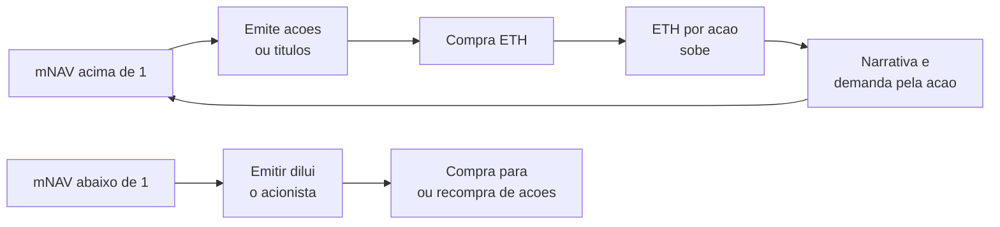

# Capítulo 53: Tesourarias Corporativas de ETH, o mNAV e o Teto de 5% da BitMine

Na semana de 7 de outubro de 2026, durante a conferência Token2049, em Singapura, o presidente da BitMine, Tom Lee, falou sobre o limite da maior tesouraria corporativa de ETH do mundo. Segundo os relatos da imprensa, a empresa pretende parar de comprar ETH ao atingir 5% da oferta em circulação e trata esse número como um teto. Um comunicado da própria empresa, do mesmo mês, informa cerca de 6,02 milhões de ETH em carteira, o equivalente a 4,9% dos 122,1 milhões de ETH em circulação. A notícia é um bom pretexto para abrir a mecânica por trás desse tipo de empresa, que o Capítulo 13 apresentou em poucas linhas como a "segunda rota institucional". Este capítulo explica como uma empresa de capital aberto vira uma pilha de ETH com CNPJ, o que é o mNAV, por que o prêmio ou o desconto sobre o valor dos ativos manda no jogo e o que muda quando o comprador marginal sai de cena. Nada aqui é recomendação de compra ou de venda de ação, de ETH ou de qualquer produto.

**O modelo em uma frase.** Uma tesouraria de ativo digital (DAT, na sigla em inglês) é uma empresa listada em bolsa cujo principal ativo de balanço é um criptoativo, comprado com dinheiro levantado de investidores. Os caminhos de financiamento mais comuns são a emissão de ações novas, a venda privada de ações a grandes investidores e a dívida, inclusive conversível. A Strategy popularizou o roteiro com Bitcoin; a BitMine e a SharpLink o aplicaram ao ETH. Para quem compra a ação, é uma forma de exposição ao ETH sem carteira, só que com o risco da empresa por cima, como o Capítulo 13 já havia comparado com os ETFs à vista.

**O mNAV, a régua de tudo.** A pergunta central de uma DAT é quanto o mercado paga pela empresa em relação ao que ela tem em ETH. A resposta é o múltiplo sobre o valor líquido dos ativos, o mNAV.

```latex
mNAV = valor de mercado da empresa / valor dos ativos em cripto

mNAV > 1  : o mercado paga um premio sobre o que a empresa guarda
mNAV < 1  : o mercado paga um desconto sobre o que a empresa guarda
```

Existem variações da conta. Alguns provedores usam o valor da empresa com dívidas e ações preferenciais em vez do valor de mercado simples, e a contagem de ações em circulação também muda de fonte para fonte. A NYDIG, segundo a CoinDesk, chegou a criticar o indicador por ignorar negócios operacionais e usar contagens de ações que podem ser imprecisas. Por isso, dois sites podem mostrar mNAVs diferentes para a mesma empresa no mesmo dia, e vale sempre ler a definição usada.

**Por que o prêmio vira combustível.** Quando o mNAV está acima de 1, emitir ação nova para comprar ETH aumenta o ETH por ação, o que se chama de emissão acretiva. Um exemplo de números redondos: uma empresa com 1 bilhão de dólares em ETH e 1 bilhão de ações tem lastro de 1 dólar por ação. Com mNAV de 2, a ação vale 2 dólares. Ao emitir 100 milhões de ações, levanta 200 milhões, e o lastro passa a 1,2 bilhão para 1,1 bilhão de ações, cerca de 1,09 dólar por ação. Quem já era acionista ficou com mais ETH por ação, e o prêmio funcionou como um motor de compra.

O inverso vale para o desconto. Com mNAV de 0,7, a ação vale 0,70 dólar, a mesma emissão de 100 milhões de ações levanta só 70 milhões, e o lastro passa a 1,07 bilhão para 1,1 bilhão de ações, algo como 0,97 dólar por ação. Emitir abaixo do valor dos ativos dilui o acionista, e a lógica da compra contínua se desfaz.


*O ciclo da esquerda só se sustenta enquanto o mercado paga prêmio; quando o mNAV cai abaixo de 1, o caminho de emissão fecha e a empresa passa a olhar para recompras e para o rendimento do ETH.*

**O que a história recente mostrou.** Os relatos de fim de 2025 indicam que o mNAV da BitMine caiu para abaixo de 1, com números reportados como 0,77 na base e 0,92 diluído, e que o setor inteiro passou por um período de desconto. Análises do setor, como a do BitcoinTreasuries.NET, argumentam que os descontos foram persistentes, e não distorções passageiras. A razão é de estrutura: acionistas minoritários não conseguem forçar a empresa a vender os ativos para fechar a diferença. É o mesmo enigma do fundo GBTC da Grayscale, que por anos negociou abaixo do valor de seu bitcoin enquanto não havia como resgatar cotas por ativos, tema que o Capítulo 13 tocou ao falar da chegada dos ETFs à vista. A Grayscale, pelas palavras de seu chefe de pesquisa Zach Pandl reportadas pela imprensa, enxerga o mNAV de longo prazo perto de 1, com algum prêmio possível se a empresa gerar retorno superior ao que o investidor teria por conta própria. Não encontrei na pesquisa os números atuais de mNAV das empresas citadas, então deixo de fora qualquer cifra de hoje.

**Quando o ativo rende: o ETH é diferente.** Uma diferença estrutural entre uma DAT de ETH e uma de Bitcoin é que o ETH pode ser aplicado em staking, como visto nos Capítulos 2 e 48. A BitMine opera para isso a MAVAN, sua rede própria de validadores. O comunicado da empresa aponta 5.067.309 ETH em staking, algo como 84% do total em carteira, número que coincide com o relato de que a empresa projeta receita anual de staking da ordem de centenas de milhões de dólares. Ter rendimento embutido dá à empresa uma segunda forma de justificar sua existência: além de acumular, ela gera fluxo de caixa em ETH, que pode pagar despesas, dividendos ou recompras. O custo é de outra natureza. O ETH em staking só sai pela fila de saída (Capítulo 49), então a tesouraria é menos líquida do que parece num dia de estresse, e os riscos de operação do validador e de slashing entram no balanço.

**O que significa um teto de 5%.** Conta simples: 5% de 122,1 milhões de ETH são cerca de 6,1 milhões, e a empresa tem cerca de 6,02 milhões, de modo que faltam algo entre 88 mil e 100 mil ETH, conforme o relato. Pelos veículos que cobriram a fala, a empresa disse que o objetivo, pensado para cinco anos, foi alcançado em cerca de 15 meses, e que depois disso o foco migra para gerar renda com os ativos que já tem, além de um programa de recompra de ações. Nem o teto nem a recompra apareceram no comunicado da empresa que consegui consultar, e o texto da fala não pôde ser aberto, então convém tratar essas partes como relato de imprensa, a conferir nos documentos da empresa. A imprensa também registrou queda de cerca de 5% no ETH e de cerca de 6% nas ações da empresa após os comentários, mas, com o mercado inteiro em baixa naquela semana por causa do petróleo e da inflação, não é possível isolar a causa.

A leitura estrutural é independente do preço do dia. Uma DAT em crescimento é um comprador contínuo de ETH, e isso é uma fonte de demanda que não vem de ETFs nem de usuários. Quando esse comprador declara um limite, a demanda marginal dessa fonte desaparece, e o preço do ETH passa a depender mais das outras origens, como os fluxos dos ETFs do Capítulo 13 e do Capítulo 52. Também vale lembrar que a quantidade de ETH em um balanço corporativo não é uma garantia de permanência: se o mNAV ficar baixo por muito tempo, a pressão para vender ativos e recomprar ações pode aparecer, e essa é uma pergunta em aberto, não uma previsão.

| Forma de exposição ao ETH | Quem guarda o ETH | Risco além do preço do ETH | Quem decide vender |
| --- | --- | --- | --- |
| Carteira própria (Capítulo 26) | Quem comprou | Perda de chave, golpes (Capítulo 27) | O próprio dono |
| ETF à vista (Capítulo 13) | Custodiante do fundo | Estrutura do fundo, taxas | Mecanismo de criação e resgate |
| Ação de DAT | A empresa | mNAV, diluição, dívida, governança | Diretoria e conselho |
| ETF alavancado (Capítulo 52) | Derivativos do fundo | Reset diário, arrasto | O gestor, todo dia |

*A mesma exposição ao ETH vem com riscos diferentes conforme quem fica com o ativo e quem decide quando vendê-lo.*

**Perguntas para ler uma DAT.** Como a empresa financia as compras: ações, dívida conversível, ações preferenciais? Qual o mNAV pela definição da própria empresa e qual a contagem de ações usada? Quanto do ETH está em staking e qual o prazo de saída? Há dívida com vencimento ou cláusulas de garantia que possam forçar a venda de ETH? O que o estatuto permite a acionistas minoritários fazer diante de um desconto persistente? A empresa tem negócio operacional além da tesouraria? São perguntas de leitura, e não indicações de resposta.

**Glossário do capítulo.**

- **DAT (tesouraria de ativo digital)**: empresa de capital aberto que mantém um criptoativo como principal reserva e financia as compras com ações ou dívida.
- **mNAV**: múltiplo entre o valor de mercado da empresa e o valor dos ativos cripto que ela guarda.
- **Emissão acretiva**: emissão de ações que aumenta o lastro por ação, o que só ocorre quando o mNAV está acima de 1.
- **Diluição**: redução da fatia ou do lastro de cada acionista quando se emitem ações abaixo do valor dos ativos.
- **Prêmio e desconto**: diferença entre o preço de mercado de um veículo e o valor dos ativos que ele detém.
- **Recompra de ações**: compra pela empresa de suas próprias ações, geralmente para reduzir o número de ações e capturar um desconto.
- **MAVAN**: rede de validadores própria da BitMine, usada para fazer staking do ETH da empresa.
- **Fila de saída**: espera imposta pelo protocolo para o ETH em staking voltar à carteira.
- **Oferta em circulação**: quantidade total de ETH existente num dado momento, base do cálculo do percentual de 5%.

**Fontes.**

As páginas de notícias não puderam ser abertas diretamente neste ambiente, então os dados vêm dos resumos de busca; os cálculos do mNAV e do percentual são próprios. Os trechos atribuídos à fala de Tom Lee vêm de relatos de imprensa e merecem conferência nos documentos da empresa.

- [CoinMarketCap Academy, Bitmine May Slow ETH Buying as 5% Supply Target Nears](https://coinmarketcap.com/academy/tr/article/bitmine-may-slow-eth-buying-5percent-target)
- [Unchained, Bitmine may slow Ethereum buying as 12 billion stash nears 5% supply goal](https://unchainedcrypto.com/bitmine-may-slow-ethereum-buying-as-12-billion-stash-nears-5-supply-goal-tom-lee-says/)
- [Comunicado da BitMine, ETH holdings reach 6.02 million tokens (CryptoDaily, outubro de 2026)](https://cryptodaily.co.uk/2026/10/bitmine-immersion-technologies-bmnr-announces-eth-holdings-reach-602-million-tokens-and-total-crypto-and-total-cash-marketable-securities-holdings-of-174-billion)
- [The Block, Tom Lee's BitMine to begin offering annual dividend as ETH treasury mNAV dips](https://www.theblock.co/post/379984/tom-lees-bitmine-to-begin-offering-annual-dividend-as-eth-treasury-mnav-dips)
- [QuickNode, Digital asset treasury companies](https://www.quicknode.com/blog/digital-asset-treasury-companies)
- [Unchained, Crypto treasury stocks are on sale, is now the time to buy](https://unchainedcrypto.com/crypto-treasury-stocks-are-on-sale-is-now-the-time-to-buy/)
- [BitcoinTreasuries.NET, The mNAV Trap](https://bitcointreasuries.net/news/the-mnav-trap-why-70percent-discounts-arent-bargains)
- [Yahoo Finance, Bitcoin and ethereum prices today, October 8, 2026](https://finance.yahoo.com/personal-finance/investing/article/bitcoin-and-ethereum-prices-today-thursday-october-8-2026-crypto-values-fall-as-oil-prices-soar-113341860.html)
