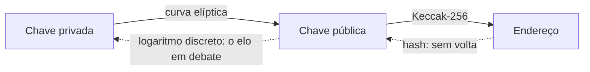

# Capítulo 54: "Bunker Mode", Quando a Ameaça Pode Ser Matemática e Não Quântica

Em 7 de outubro de 2026, o pesquisador da Ethereum Foundation Justin Drake publicou na rede X um alerta que se espalhou rápido: segundo os relatos da imprensa, avanços de inteligência artificial em matemática poderiam enfraquecer a criptografia de curvas elípticas antes mesmo de existirem computadores quânticos úteis, e por isso ele recomendou um "bunker mode", um plano gradual de mover fundos para endereços novos. A resposta veio dividida. Vitalik Buterin disse que o risco é real, mas pediu calma, e o chefe de criptografia da Coinbase, Yehuda Lindell, chamou o alerta de FUD. Este capítulo não toma partido sobre a probabilidade do ataque, que ninguém consegue medir de fora. O objetivo é explicar a mecânica por trás da discussão: por que um endereço que nunca assinou nada é diferente de um que já assinou, o que significa mover fundos para um endereço novo, e quais riscos a própria migração cria. O Capítulo 44 trata do lado quântico e do plano de longo prazo do Ethereum, e este complementa aquele com o cenário que só ganhou manchete agora. Nada aqui é recomendação de compra, venda ou movimentação de fundos.

**O que foi dito, e o que ainda é hipótese.** Pelos relatos, Drake definiu como pior caso um atacante que recupera uma chave privada a partir de uma chave pública em cerca de uma semana, usando um grande conjunto de GPUs. Ele ligou a preocupação a resultados recentes de modelos de IA em matemática, citados nas notícias como uma publicação da OpenAI com 722 manuscritos produzidos por um modelo interno. A frase central dele, nos relatos, é que curvas elípticas têm muita estrutura algébrica para se explorar, enquanto funções de hash são desenhadas para ter o mínimo possível de estrutura. Buterin concordou publicamente que o risco existe, advertiu contra a pressa e citou perdas pessoais em migrações malfeitas. Lindell disse que não há nenhuma evidência de que as hipóteses de dificuldade que sustentam a criptografia de curvas elípticas tenham sido enfraquecidas. O ponto de partida honesto é este: até onde alcançam as fontes abertas, nenhum ataque desse tipo foi publicado. Trata-se de uma hipótese defendida por um pesquisador respeitado e contestada por outro, e não de um fato.

**A cadeia que protege um endereço.** Para entender a recomendação é preciso rever o caminho do Capítulo 26. A chave pública é gerada a partir da privada pelo algoritmo ECDSA, e o endereço é formado pelos últimos 20 bytes do hash Keccak-256 da chave pública, segundo a documentação do ethereum.org. A direção contrária, da pública para a privada, é o problema que se presume difícil.

*As setas contínuas são fáceis de calcular; as tracejadas são as direções que se presumem inviáveis, e a segunda delas é a que o alerta de Drake colocaria em dúvida.*

**Por que "nunca assinou" faz diferença.** Um endereço que só recebeu fundos expõe ao mundo apenas o hash da chave pública. Quem quisesse atacá-lo teria de quebrar duas camadas: reverter o hash e depois resolver o logaritmo discreto. Quando o dono envia a primeira transação, a assinatura permite recuperar a chave pública, que fica registrada para sempre na cadeia. A partir daí, a camada do hash deixou de proteger, e resta apenas a curva elíptica. É por isso que a recomendação de Drake, nos relatos, é concentrar fundos em endereços que nunca assinaram, e que a regra de higiene de não reutilizar endereços já aparecia no Capítulo 44.

| Situação do endereço | O que a cadeia mostra | Camadas entre o atacante e a chave privada |
| --- | --- | --- |
| Só recebeu fundos, nunca assinou | O hash da chave pública | Hash e curva elíptica |
| Já enviou ao menos uma transação | A chave pública, recuperável da assinatura | Apenas a curva elíptica |
| Conta de contrato com lógica própria (Capítulo 24) | Depende do esquema de assinatura do contrato | Depende do esquema escolhido |

*A exposição não é igual para todo mundo: o histórico de assinaturas do endereço decide quantas camadas ainda protegem os fundos.*

**Mover para um endereço novo: o que muda e o que não muda.** A recomendação relatada é gradual: grandes detentores e custodiantes levariam a maior parte dos ativos a endereços que nunca assinaram e, depois de usar um deles para enviar fundos, passariam o saldo restante a outro endereço novo. Na prática, isso é um novo ciclo do Capítulo 26: gerar chaves novas, de preferência em um dispositivo confiável, e transferir. Há três ressalvas importantes.

- O endereço novo continua usando a mesma curva elíptica. Ele só esconde a chave pública enquanto não assina. Quando o dono precisar gastar, a chave pública aparece, e o atacante hipotético teria uma janela entre a transmissão da transação e a inclusão no bloco, que no Ethereum é curta, mas não nula.
- A migração em si é um momento de risco. Digitar um endereço errado, cair no envenenamento de endereço ou assinar uma aprovação enganosa são golpes reais e atuais, descritos no Capítulo 27, e muito mais prováveis hoje do que um ataque matemático hipotético. Foi esse o sentido do aviso de Buterin.
- Contratos já implantados, como pools de DeFi e cofres de protocolos, não se movem para um endereço novo por vontade do usuário. Quem deposita fundos neles depende da decisão do protocolo e da rede.

**O papel do protocolo.** Nenhuma carteira individual resolve o problema de fundo, que é trocar a primitiva de assinatura. É exatamente o que o plano pós-quântico do Capítulo 44 prevê, com contas programáveis (Capítulo 24), verificação de assinaturas resistentes a ataques quânticos e um caminho de migração. Uma observação de Buterin, segundo os relatos, é que mesmo a criptografia baseada em reticulados, tratada como segura contra computadores quânticos, poderia sofrer abalos com o avanço de matemática assistida por IA. Isso mostra por que o desenho da migração busca flexibilidade: a rede quer poder trocar o esquema de assinatura sem depender de uma aposta única. O cronograma divulgado pela Ethereum Foundation para uma camada base resistente a ataques quânticos aponta para algo em torno de 2029, conforme os relatos já citados no capítulo anterior sobre o tema.

**Como pesar o alerta sem pânico.** Dois cuidados evitam os extremos. O primeiro é separar a fonte do risco: o enfraquecimento de uma hipótese matemática é um evento de baixa probabilidade e alto impacto que ninguém sabe precificar, enquanto golpes e erros de operação são de alta probabilidade e já causam perdas. O segundo é separar o sinal do ruído do mercado: os relatos associam a repercussão do alerta a uma queda de preço naquela semana, mas outros fatores atuaram ao mesmo tempo, como a pressão de petróleo e inflação, a série de saídas dos ETFs de ETH (Capítulo 52) e o anúncio da BitMine do Capítulo 53, de modo que não é possível isolar a causa. A disciplina que serve em qualquer cenário é a mesma: entender onde a chave pública já está exposta, não reutilizar endereços sem necessidade, acompanhar o que a rede e as carteiras anunciarem e evitar decisões apressadas de movimentação em dias de manchete.

**Glossário do capítulo.**

- **Bunker mode**: expressão usada por Justin Drake para um plano defensivo de mover fundos, de forma gradual, para endereços cujas chaves públicas nunca foram expostas.
- **ECDSA**: algoritmo de assinatura digital sobre curvas elípticas usado pelas contas comuns do Ethereum.
- **Logaritmo discreto**: problema matemático cuja dificuldade presumida impede calcular a chave privada a partir da pública.
- **Keccak-256**: função de hash usada para derivar o endereço a partir da chave pública.
- **Chave pública exposta**: situação em que uma assinatura on-chain tornou a chave pública conhecida, retirando a proteção adicional do hash.
- **FUD**: sigla do inglês para medo, incerteza e dúvida, usada para criticar alertas considerados exagerados e sem evidência.
- **Reticulados (lattice)**: família de problemas matemáticos usada em criptografia considerada resistente a computadores quânticos.
- **Envenenamento de endereço**: golpe que insere na lista de transações um endereço parecido com o de um contato, para induzir um envio errado.

**Fontes.**
- [Ethereum Accounts, ethereum.org (derivação do endereço, via repositório do site)](https://raw.githubusercontent.com/ethereum/ethereum-org-website/dev/public/content/developers/docs/accounts/index.md)
- [Crypto industry split over Justin Drake's AI warning, The Block (resultado de busca; página não pôde ser aberta)](https://www.theblock.co/news/defi/2026-10-08-crypto-industry-split-over-justin-drakes-ai-warning-418021)
- [Ethereum Researcher Warns AI Could Crack Crypto Before Q-Day, Cointelegraph (resultado de busca; página não pôde ser aberta)](https://cointelegraph.com/news/justin-drake-urges-crypto-bunker-mode-as-ai-could-break-wallet-security-within-months)
- [Drake urges crypto 'bunker mode'; Buterin backs AI math risk, AI Weekly (resultado de busca; página não pôde ser aberta)](https://aiweekly.co/alerts/drake-urges-crypto-bunker-mode-buterin-backs-ai-math-risk)
- [OpenAI math breakthroughs raise 'bunker mode' alarm, CryptoSlate (resultado de busca; página não pôde ser aberta)](https://cryptoslate.com/openais-math-breakthrough-raises-fears-ai-could-break-bitcoin-and-ethereum-security-within-months/)
