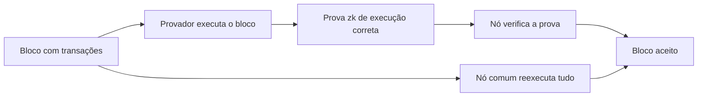
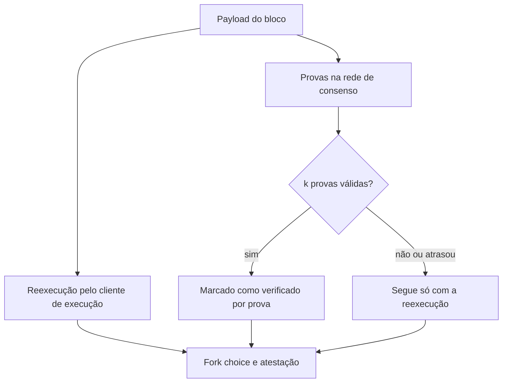

# Capítulo 55: Provas ZK no L1, zkEVM e as Provas de Execução Opcionais (EIP-8025)

Hoje, para confiar que um bloco do Ethereum é válido, cada nó refaz todas as transações do bloco. É um método simples e muito robusto, mas que amarra o tamanho do bloco ao que um computador comum aguenta calcular. Uma das ideias mais ambiciosas do roteiro do Ethereum é trocar a reexecução por uma verificação barata de uma prova matemática. Este capítulo explica como isso funciona, quais metas a Ethereum Foundation estabeleceu, em que pé estão os testes e por que a proposta EIP-8025 foi desenhada para ser opcional no começo. O Capítulo 9 tratou de zkEVMs em rollups, e o Capítulo 37 apresentou a ideia de nós sem estado; aqui os dois fios se encontram, agora na camada base. Nada aqui é recomendação de compra ou venda.

**Do "N de N" ao "1 de N".** Segundo a página de roteiro do ethereum.org, o modelo atual é "N de N": todo validador reexecuta todas as transações, o que é maximamente independente de confiança, mas limita a vazão ao que um validador médio consegue processar. No modelo "1 de N", um único agente especializado, o provador, executa o bloco e produz uma prova (SNARK ou STARK) de que a execução foi correta; se a execução estivesse errada, não seria possível gerar uma prova válida. Os demais nós só verificam a prova, o que a página descreve como ordens de grandeza mais barato.

*Os dois caminhos chegam ao mesmo resultado: o de baixo é o modelo atual, que exige reexecução, e o de cima troca a reexecução por verificar uma prova.*

**Por que isso importa.** De acordo com o ethereum.org, a verificação barata permitiria aumentar o limite de gás com mais segurança, reduziria os requisitos de hardware dos validadores, favorecendo a descentralização e a resistência à censura, e daria um tempo de verificação constante, independente da complexidade do bloco. Isso conversa com o que o Capítulo 39 mostrou sobre execução em paralelo e com o Capítulo 43 sobre o custo de estado: são caminhos diferentes para o mesmo gargalo, a capacidade de os nós acompanharem a rede.

**O desafio do relógio.** Blocos chegam a cada 12 segundos, então a prova precisa ficar pronta em escala de tempo parecida. O ethereum.org registra que implementações de zkEVM podiam levar de minutos a horas para provar um único bloco. Além disso, a página destaca que, para o L1, é essencial um zkEVM do tipo 1, totalmente equivalente ao Ethereum, já que qualquer desvio arrisca problemas de consenso. A página também lista os zkVMs em teste, que executam o código da EVM sobre máquinas virtuais baseadas em RISC-V: OpenVM, RISC Zero, Airbender e Jolt (rv32im) e Zisk (rv64ima).

**As metas de "tempo real".** Segundo resultados de busca que resumem o ensaio "Shipping an L1 zkEVM #1: Realtime Proving", de Sophia Gold, publicado em 10 de julho de 2025 (a página original não pôde ser aberta nesta pesquisa), as metas são:

| Critério | Meta |
| --- | --- |
| Latência | 99% dos blocos provados em até 10 segundos |
| Segurança | 128 bits (com mínimo de 100 bits no lançamento) |
| Tamanho da prova | até 300 KiB |
| Custo do hardware | até US$ 100 mil |
| Consumo de energia | até 10 kW |

*Os limites de custo e energia existem para que provar não vire privilégio de poucos: a ideia é que um operador de porte modesto consiga fazê-lo.*

O mesmo resumo diz que a visão é que validadores verifiquem três provas independentes, de zkVMs diferentes, ecoando a lógica de diversidade do Capítulo 28. A medida de progresso é publicada, mas os números de empresas sobre seus próprios sistemas (por exemplo, a Succinct com 94% dos blocos em menos de 12 segundos em 160 GPUs RTX 4090, e a Brevis com mais de 99% usando 64 RTX 5090, segundo agregadores) são resultados divulgados pelos próprios fornecedores e não substituem medições independentes.

**A EIP-8025, provas opcionais.** O texto da proposta, ainda em estado de rascunho, descreve um mecanismo em que nós provadores altruístas geram provas de execução e as espalham na rede de consenso, e nós verificadores as conferem. O ponto central é a cautela: o mecanismo é totalmente opcional e não muda as regras de validade do consenso. Os verificadores ainda reexecutam o payload, e ele passa a contar como "verificado por prova" depois de `k` provas válidas, valor que ainda não foi definido. Se a prova não chegar ou chegar tarde, o nó segue com o fork choice calculado pela reexecução, e validadores não devem atrasar a validação ou a atestação esperando por uma prova. Como as provas não são essenciais para o consenso, uma prova defeituosa não pode bifurcar a rede nem causar slashing. A geração de provas não tem incentivo no protocolo. Um parâmetro de tamanho máximo de prova de 400 KiB e um limite de quatro provas por payload aparecem na especificação. Segundo um resumo de busca do blog de zkEVM da Ethereum Foundation (não aberto), a proposta é voltada ao fork Hegotá, tratado no Capítulo 42, mas a inclusão no fork não estava confirmada nas fontes consultadas.

*A prova é um sinal extra: a atestação nunca espera por ela, e na falta dela o nó cai no caminho tradicional.*

**Por que começar opcional.** Fazer o recurso opcional deixa a pilha de provas amadurecer em uma rede viva, sem risco para quem não aderiu. Segundo o texto da EIP, uma proposta futura poderia tornar as provas obrigatórias e dispensar a reexecução. Esse é o degrau final, e depende de provas rápidas, baratas, seguras e com mais de um sistema independente. Vale lembrar que todo sistema de provas é software novo e complexo: um bug no verificador ou no circuito é, em essência, um bug de consenso em potencial, razão pela qual a diversidade e o período opcional importam. O cenário também se conecta ao Capítulo 44, onde o leanVM e a assinatura pós-quântica fazem parte da mesma direção de longo prazo.

**Quanto disso é fato e quanto é plano.** São fatos o modelo atual de reexecução, as metas publicadas e o conteúdo do rascunho da EIP-8025. São planos, sem data confirmada nas fontes abertas, a inclusão em um fork e qualquer passagem para provas obrigatórias.

**Glossário do capítulo.**

- **Provador (prover)**: agente que executa o bloco e gera a prova de que a execução foi correta.
- **zkEVM**: sistema que prova, com conhecimento zero, a execução correta de transações da EVM.
- **zkVM**: máquina virtual cuja execução pode ser provada; no caso aqui, baseadas em RISC-V.
- **SNARK e STARK**: famílias de provas de conhecimento zero, com propriedades diferentes de tamanho e de hipóteses de segurança.
- **Tipo 1 (zkEVM)**: zkEVM totalmente equivalente ao Ethereum, sem alterar a EVM.
- **Prova em tempo real**: prova gerada em tempo compatível com o intervalo de 12 segundos entre blocos.
- **Verificação sem estado**: checar a validade de um bloco sem manter o estado completo da rede.
- **Payload de execução**: conteúdo de execução de um bloco (transações e resultados) que o consenso referencia.
- **EIP-8025**: proposta de provas de execução opcionais, em rascunho.

**Fontes.**
- [zkEVM for L1 block verification, ethereum.org (via repositório do site)](https://raw.githubusercontent.com/ethereum/ethereum-org-website/dev/public/content/roadmap/zkevm/index.md)
- [EIP-8025: Optional Execution Proofs (texto no repositório de EIPs)](https://raw.githubusercontent.com/ethereum/EIPs/master/EIPS/eip-8025.md)
- [Shipping an L1 zkEVM #1: Realtime Proving, blog da Ethereum Foundation (resultado de busca; página não pôde ser aberta)](https://blog.ethereum.org/2025/07/10/realtime-proving)
- [EIP-8025 Optional Execution Proofs for Hegotá, blog zkEVM da Ethereum Foundation (resultado de busca; página não pôde ser aberta)](https://zkevm.ethereum.foundation/blog/eip-8025-optional-execution-proofs-hegota)
- [Ethereum devs plan Layer 1 zkEVM rollout, The Block (resultado de busca; página não pôde ser aberta)](https://www.theblock.co/post/362170/ethereum-zkevm-zk-proofs)
- [Ethereum's Pico Prism zkVM, MEXC News (resultado de busca; página não pôde ser aberta)](https://www.mexc.com/en-NG/news/132937)
