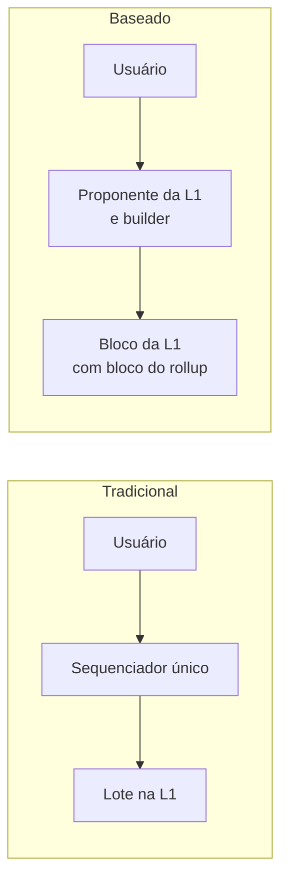
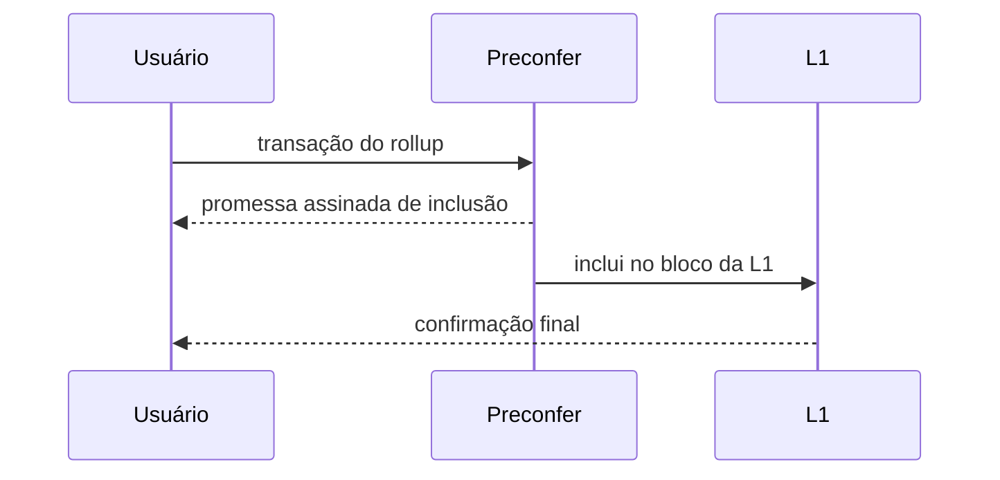

# Capítulo 56: Rollups Baseados e Pré-Confirmações, Quando a L1 Ordena a L2

O Capítulo 5 mostrou que quase todo rollup depende de um sequenciador, e que na maioria das redes em produção esse papel é exercido por uma única entidade. Isso trouxe velocidade e taxas baixas, mas deixou três riscos em aberto: queda do serviço, censura e extração de MEV por quem ordena. Existe uma família de desenhos que tenta resolver o problema pela raiz, entregando a ordenação à própria Ethereum. São os rollups baseados (*based rollups*). Este capítulo explica a ideia, o que se ganha, o que se perde e por que as pré-confirmações entraram na conversa. Nada aqui é recomendação de compra ou venda.

**A ideia central.** Segundo definição atribuída a Justin Drake e citada por fontes secundárias, um rollup é baseado, ou sequenciado pela L1, quando a sua ordenação é conduzida pela camada base. Na prática, em vez de um servidor da empresa decidir a ordem, o proponente de bloco da Ethereum que for o próximo da fila pode incluir os blocos do rollup no seu próprio bloco da L1, trabalhando com os mesmos builders e searchers que já existem (Capítulos 17 e 38). Não há um sequenciador extra para ser pressionado, comprado ou derrubado.

*No modelo tradicional, um ator próprio do rollup ordena e depois publica; no baseado, a ordenação sai direto do processo de produção de blocos da L1.*

**O que se ganha.** As fontes consultadas apontam três vantagens principais. A primeira é herdar a vivacidade (*liveness*) e a resistência à censura da L1, porque o rollup não acrescenta um ponto único de falha. A segunda é a neutralidade: não há operador privilegiado cuja permissão seja necessária. A terceira é a composabilidade. Como o mesmo agente pode ordenar transações da L1 e de vários rollups baseados, em teoria fica possível uma interação síncrona entre eles, algo que rollups com sequenciadores separados não oferecem com facilidade. Vale registrar que esses argumentos vêm de defensores do modelo; são propriedades de desenho, e não resultados medidos em produção em larga escala.

**O que se perde.** O custo principal é a latência. Um rollup baseado herda o ritmo de blocos de 12 segundos da L1, enquanto sequenciadores centralizados costumam devolver uma resposta quase imediata. Há ainda uma questão econômica: o valor de ordenar (o MEV do rollup) passa para os proponentes e builders da L1, o que muda quem captura essa receita e tira da equipe do rollup uma fonte de caixa que muitos projetos usam para se sustentar. Compare com o Capítulo 7, em que o Superchain trata a receita do sequenciador como parte do arranjo econômico.

**Pré-confirmações, a ponte entre os dois mundos.** Para atacar a latência, a proposta é que proponentes da L1 se comprometam, antecipadamente, a incluir ou executar a transação de um usuário. Segundo as fontes consultadas, validadores aderem voluntariamente a um protocolo de pré-confirmação, oferecem uma garantia adicional (por exemplo, stake restakeado, como no Capítulo 4) e aceitam condições extras de slashing. Quando chega a vez de propor, podem emitir promessas assinadas, as pré-confirmações. É comum delegar esse papel a um agente especializado, o *preconfer*. A promessa vale porque quebrá-la custa dinheiro.

*O usuário recebe uma resposta rápida do preconfer e, depois, a confirmação definitiva quando o bloco da L1 é finalizado; se o preconfer quebrar a promessa, perde a garantia.*

**A infraestrutura que a L1 precisou ganhar.** Para o usuário saber a quem pedir a promessa, é preciso conhecer os próximos proponentes. A EIP-7917, de Lin Oshitani e Justin Drake, com status Final, guarda no estado de consenso a lista de proponentes das épocas seguintes. Seu texto afirma que protocolos de pré-confirmação baseados na L1 dependem de uma agenda determinística de proponentes. Esse é o mesmo `proposer_lookahead` visto no Capítulo 41. Outro elo é a resistência à censura dentro da própria L1: a EIP-7547, de listas de inclusão, tem hoje status Stagnant, e a linha que continuou é o FOCIL, tratado no Capítulo 42.

**Quem tenta na prática.** O Taiko se descreve no próprio repositório como "o primeiro rollup baseado". De acordo com um resultado de busca que resume reportagem do The Block (a página não pôde ser aberta nesta pesquisa), o Taiko ativou pré-confirmações em sua mainnet em agosto de 2025, numa primeira fase com preconfers de uma lista aprovada, com a abertura a qualquer participante prevista para uma fase posterior. As metas de 2026 publicadas pelo projeto, como pré-confirmações totalmente descentralizadas, não puderam ser confirmadas como entregues em fontes abertas.

| Característica | Sequenciador único | Rollup baseado |
| --- | --- | --- |
| Quem ordena | Operador do rollup | Proponente/builder da L1 |
| Latência de resposta | Muito baixa | 12 s, ou menos com pré-confirmação |
| Risco de censura | Depende do operador | Herda o da L1 |
| Se o operador cai | Rollup para (com saída forçada) | Não há operador a cair |
| Receita de ordenação | Fica com o rollup | Vai para a L1 |
| Maturidade em produção | Ampla | Inicial |

*A escolha é uma troca entre velocidade e receita de um lado, e neutralidade e robustez do outro.*

**Como avaliar.** Alguns pontos úteis: quem de fato emite as pré-confirmações e se a lista é aberta ou aprovada; que garantia sustenta a promessa e quanto valeria quebrá-la frente ao ganho possível; o que acontece com o usuário se o preconfer falhar; e se o ganho de neutralidade compensa a perda de receita para o projeto. É a mesma disciplina de perguntas do Capítulo 50, aplicada a um desenho diferente.

**Fato e plano.** São fatos o texto da EIP-7917 e o status das EIPs citadas. São desenho teórico ou plano as vantagens de composabilidade síncrona e a descentralização completa das pré-confirmações, que dependem de adoção e de segurança ainda por demonstrar.

**Glossário do capítulo.**

- **Rollup baseado (*based rollup*)**: rollup cuja ordenação de transações é conduzida pela L1.
- **Sequenciador**: ator que ordena as transações de um rollup e monta os lotes enviados à L1.
- **Pré-confirmação**: promessa assinada, lastreada em garantia, de que uma transação será incluída.
- **Preconfer**: agente que emite pré-confirmações, próprio proponente ou delegado.
- **Proposer lookahead**: lista no estado de consenso com os proponentes das próximas épocas (EIP-7917).
- **Composabilidade síncrona**: capacidade de contratos de redes diferentes interagirem na mesma operação atômica.
- **Liveness**: propriedade de a rede continuar processando transações.
- **Lista de inclusão**: mecanismo para obrigar a inclusão de transações, como contra a censura.
- **Slashing**: penalidade que destrói parte da garantia de quem viola uma regra.

**Fontes.**
- [EIP-7917, Deterministic Proposer Lookahead](https://raw.githubusercontent.com/ethereum/EIPs/master/EIPS/eip-7917.md)
- [EIP-7547, Inclusion lists](https://raw.githubusercontent.com/ethereum/EIPs/master/EIPS/eip-7547.md)
- [Roteiro de escalabilidade, ethereum.org (via repositório do site)](https://raw.githubusercontent.com/ethereum/ethereum-org-website/dev/public/content/roadmap/scaling/index.md)
- [README do repositório taiko-mono](https://raw.githubusercontent.com/taikoxyz/taiko-mono/main/README.md)
- [Based rollups, superpowers from L1 sequencing, ethresear.ch (resultado de busca; página não pôde ser aberta)](https://ethresear.ch/t/based-rollups-superpowers-from-l1-sequencing/15016)
- [Based rollup Taiko activates preconfirmations, The Block (resultado de busca; página não pôde ser aberta)](https://www.theblock.co/post/366499/based-rollup-taiko-activates-preconfirmations-to-speed-up-its-layer-2-transactions)
- [Based rollups, the new ETH alignment, Delphi Digital (resultado de busca; página não pôde ser aberta)](https://members.delphidigital.io/reports/based-rollups-the-new-eth-alignment)
