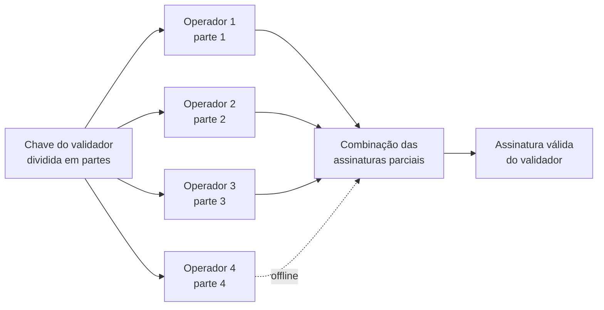
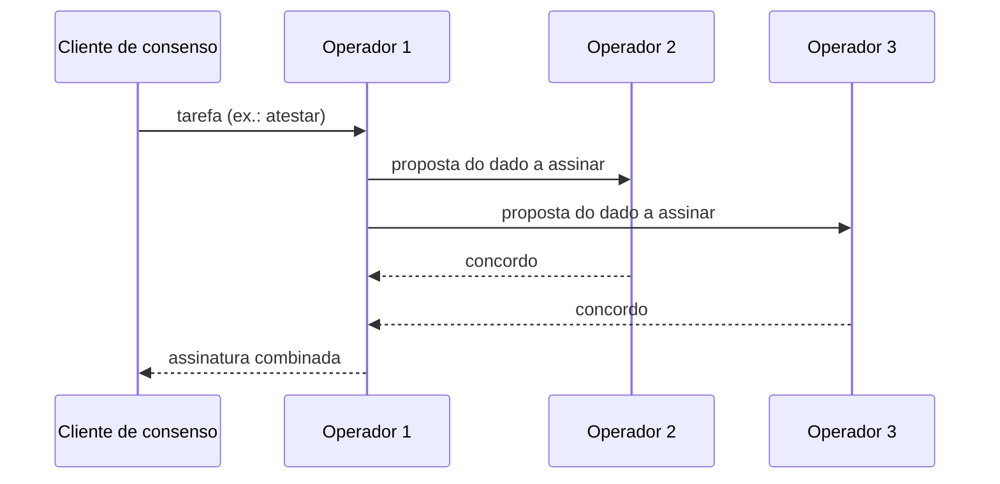

# Capítulo 57: Validadores Distribuídos (DVT), Quando a Chave do Validador Vive em Várias Máquinas

O Capítulo 49 mostrou o que acontece quando uma única infraestrutura de staking é comprometida: a chave de assinatura fica online, em um lugar só, e um incidente nesse lugar vira problema para todos os validadores ali hospedados. Um validador tradicional tem esse ponto único de falha embutido. Se a máquina cai, o validador deixa de atestar e perde recompensas; se a máquina é invadida, a chave pode ser usada indevidamente. A tecnologia de validadores distribuídos (*Distributed Validator Technology*, DVT) tenta atacar os dois problemas ao mesmo tempo. Este capítulo explica a ideia, a matemática simples por trás dela, as duas implementações mais conhecidas (Obol e SSV Network) e os limites do que ela promete. Nada aqui é recomendação de compra ou venda.

**O problema de partida.** No desenho clássico visto no Capítulo 2, cada validador tem uma chave de assinatura que precisa estar disponível o tempo todo para atestar e propor blocos. Há duas formas ingênuas de dar mais robustez: copiar a mesma chave para duas máquinas, ou manter uma única máquina muito bem protegida. A primeira cria o risco de as duas assinarem coisas conflitantes e gerarem slashing; a segunda mantém o ponto único de falha. A DVT propõe uma terceira via: ninguém guarda a chave inteira.

**A ideia central.** Segundo a ethereum.org, a DVT divide a responsabilidade de um validador entre vários nós, de modo que ele continue funcionando mesmo que alguns deles fiquem offline, e o conjunto é resiliente até se alguns nós forem maliciosos ou preguiçosos. A chave do validador é fragmentada em partes (*key shares*) por meio de criptografia de limiar (*threshold*), e cada operador guarda apenas uma parte. Uma tarefa, como atestar, só é assinada quando um número mínimo de operadores concorda e cada um contribui com uma assinatura parcial. As partes são combinadas numa assinatura única e válida, que para o resto da rede é indistinguível da de um validador comum. Para a camada de consenso, nada muda.


*Quatro operadores guardam uma parte cada; três assinaturas parciais bastam para formar a assinatura final, então o quarto operador pode estar fora do ar sem que o validador pare.*

**A matemática do limiar.** Os clusters costumam seguir o modelo tolerante a falhas bizantinas: com `n = 3f + 1` operadores, o cluster tolera até `f` operadores com defeito ou má-fé. A documentação da SSV Network diz que o número de operadores precisa ser compatível com 3f+1, citando clusters de 4, 7, 10 ou 13 operadores. A documentação da Obol informa que o mínimo é de 4 operadores com limiar de 3, e que o limiar padrão é calculado pela fórmula abaixo, que a própria documentação recomenda manter porque maximiza a disponibilidade sem abrir mão da segurança bizantina.

```latex
limiar(n) = n - (ceil(n / 3) - 1)

n = 4  ->  4 - (2 - 1) = 3   (tolera 1 falha)
n = 7  ->  7 - (3 - 1) = 5   (tolera 2 falhas)
```

Há um detalhe contraintuitivo, também apontado pela Obol: configurar um cluster de 4 operadores com limiar 4 de 4 deixaria o validador mais vulnerável a ficar offline, não menos, porque qualquer ausência o pararia. Limiar alto demais troca disponibilidade por uma sensação de segurança.

**Como os operadores concordam.** Assinar com um limiar não basta. Os operadores precisam concordar sobre o que assinar, senão cada um poderia assinar um dado diferente. A Obol descreve o Charon, seu *middleware* de código aberto, como a camada que fica entre o cliente de consenso e o cliente validador e faz o cluster chegar a um acordo antes de produzir a assinatura; a página de arquitetura menciona um passo de consenso do tipo QBFT. Os detalhes do protocolo de consenso não puderam ser lidos na íntegra nesta pesquisa, então o capítulo se limita a essa descrição geral. O arranjo recorda o Capítulo 2: assim como a rede exige maioria qualificada de validadores, o cluster exige maioria qualificada de operadores, em miniatura.


*Os operadores primeiro concordam sobre o que assinar e só então enviam assinaturas parciais, que são combinadas numa só.*

**Obol e SSV, duas abordagens.** As duas redes implementam a mesma ideia geral, com diferenças de produto e organização.

| Aspecto | Obol (Charon) | SSV Network |
| --- | --- | --- |
| Papel principal | Middleware que cada operador roda ao lado do seu cliente | Rede de operadores que recebem partes de chaves |
| Formação do cluster | Grupo faz a geração distribuída de chaves e configura o cluster pelo DV Launchpad | Dono do validador escolhe operadores e distribui as partes |
| Tamanho mínimo | 4 operadores, limiar 3 | 4 operadores, em múltiplos de 3f+1 |
| Tolerância | n = 4 tolera 1 falha; n = 7 tolera 2 | 4 tolera 1; 7 tolera 2; 10 tolera 3; 13 tolera 4 |

*Ambas partem do mesmo princípio; a diferença está em quem forma o cluster e como as partes das chaves chegam aos operadores.* Uma observação de cautela: páginas espelhadas da SSV divergem sobre o limiar exato de assinatura, com a página oficial citando exemplos como 3 de 4 e 5 de 7, de modo que quem for operar deve consultar a especificação vigente.

**Onde isso já é usado.** O caso mais visível é o módulo Simple DVT da Lido, tema que aparece no Capítulo 3. Segundo o blog da Lido, a DAO aprovou o módulo em outubro de 2023, com 99,99% de apoio entre os votantes que participaram, e o piloto de mainnet usou as soluções da Obol e da SSV. Os primeiros 12 clusters da Obol entraram em operação em maio de 2024, e a capacidade inicial do módulo foi limitada a 0,5% de todo o ETH em staking, com um aumento para 4% aprovado depois em votação. A ideia era diversificar o conjunto de operadores, aceitando operadores menores que, juntos num cluster, produzem um serviço comparável ao de um grande. A Lido relata que, ao fim do quarto trimestre de 2025, mais de 22 mil validadores DVT operados por operadores da Obol e da SSV, somando todos os módulos da Lido, cobriam perto de 2% de todo o ETH em staking. Esses números vêm de relatos da própria Lido e da Obol, partes interessadas, e não de uma medição independente.

**O que a DVT não resolve.** O primeiro limite é o slashing: se operadores em número suficiente para atingir o limiar conspirarem, podem assinar algo punível, e o validador é penalizado como qualquer outro. A DVT reduz a chance de um defeito isolado causar o problema, mas não o impede por completo. O segundo é a coordenação: mais mensagens trocadas entre operadores significam mais latência, e atestar dentro da janela do slot exige cuidado com a distribuição geográfica dos nós. O terceiro é a complexidade: há mais software, mais pontos de configuração e novas superfícies de ataque, como o momento da geração distribuída das chaves. O quarto é a pergunta de quem escolhe os operadores e com que garantias, que é uma questão de governança, a mesma discutida no Capítulo 19. Por fim, ela não altera a credencial de saque nem o destino das recompensas, as outras duas peças vistas no Capítulo 49, que continuam sendo definidas à parte.

**Por que importa para a rede.** O Capítulo 28 tratou da diversidade de clientes como defesa contra bugs de software. A DVT é uma diversidade de outro tipo: de operadores e de infraestrutura dentro de um mesmo validador. Se cada validador de um grande provedor de staking líquido (Capítulo 3) for operado por vários participantes independentes, um incidente num deles deixa de comprometer o conjunto. Isso não elimina a concentração de stake em poucos protocolos, mas muda o que uma falha técnica pontual consegue fazer.

**Fato e plano.** São fatos documentados o conceito de partes de chave com limiar, as fórmulas de tolerância e os marcos do Simple DVT citados acima. O alcance futuro da adoção, e a ideia de que a DVT poderia virar padrão de fato para grandes operadores, são expectativas que dependem de adoção, de custos e de incentivos ainda em maturação.

**Glossário do capítulo.**

- **DVT (*Distributed Validator Technology*)**: tecnologia que divide as funções de um validador entre vários nós, sem que um só detenha a chave completa.
- **Key share**: parte fragmentada da chave de um validador, guardada por um único operador do cluster.
- **Criptografia de limiar (*threshold*)**: esquema em que um número mínimo de participantes é suficiente para executar uma operação, como assinar.
- **Cluster**: grupo de operadores que opera em conjunto um ou mais validadores distribuídos.
- **Tolerância a falhas bizantinas**: capacidade de um sistema continuar correto mesmo que parte dos participantes falhe ou aja de má-fé; com `n = 3f + 1`, tolera `f` participantes assim.
- **Geração distribuída de chaves (DKG)**: procedimento em que os operadores criam as partes da chave sem que a chave inteira exista em um só lugar.
- **Charon**: middleware de código aberto da Obol que coordena o cluster entre o cliente de consenso e o cliente validador.
- **Simple DVT**: módulo da Lido que usa clusters DVT de operadores menores para diversificar o conjunto de operadores.
- **Assinatura parcial**: assinatura produzida por um operador com sua parte da chave, que só vale ao ser combinada com as demais.

**Fontes.**

Observação de transparência: nesta execução o ambiente não conseguiu abrir páginas diretamente; as informações abaixo vieram dos resultados e trechos devolvidos pela busca web para estes endereços, e não de leitura integral das páginas.

- https://ethereum.org/en/staking/dvt/
- https://legacy-docs.obol.org/v0.19.0/int/faq/general
- https://docs.obol.org/learn/charon/intro
- https://docs.ssv.network/learn/tech-overview
- https://docs.ssv.network/learn/security/
- https://blog.lido.fi/a-year-with-simple-dvt-strengthening-ethereum-staking-through-diversity-and-resilience/
- https://blog.lido.fi/simpledvt-new-phase-for-lido-on-ethereum/
- https://blog.obol.org/simple-dvt/
