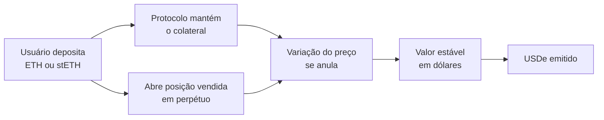

# Capítulo 58: Ethena e o USDe, o Dólar Sintético e o Hedge Delta-Neutro

Os Capítulos 14 e 15 apresentaram duas formas de manter uma moeda estável perto de um dólar: reservas em ativos tradicionais, como no USDC, e colateral cripto em excesso, como no DAI. Existe uma terceira família, mais estranha à primeira vista, em que o lastro não é uma conta bancária nem um cofre de colateral, e sim uma operação financeira em andamento. É o caso do USDe, da Ethena. Este capítulo explica como a ideia funciona, de onde vem o rendimento anunciado, por que o Capítulo 51 já havia citado o USDe no episódio de 10 de outubro de 2025 e quais riscos ficam do lado de quem usa. Nada aqui é recomendação de compra ou venda.

**A ideia central.** O USDe se descreve como um dólar sintético. Segundo as descrições da Ethena e de análises independentes, o protocolo recebe como colateral ativos como ETH, BTC, stablecoins e tokens de staking líquido, como o stETH do Capítulo 3, e abre ao mesmo tempo uma posição vendida em contratos perpétuos, na mesma quantidade, em corretoras. Se o ETH cai, a perda no colateral é compensada pelo ganho na posição vendida; se o ETH sobe, ocorre o oposto. Como a exposição líquida ao preço fica próxima de zero, o conjunto vale aproximadamente o mesmo em dólares, e é isso que sustenta a paridade. A estratégia é chamada de delta-neutra, porque o delta, a sensibilidade ao preço, é anulado.


*O colateral e a posição vendida se movem em sentidos opostos, e a soma fica estável em dólares, o que permite emitir o USDe.*

**De onde vem o rendimento.** A posição vendida em perpétuos recebe ou paga a taxa de financiamento explicada no Capítulo 51. Quando o mercado está inclinado para comprados, que é o estado mais comum em cripto, os comprados pagam aos vendidos, e a Ethena fica do lado que recebe. Se o colateral for um ativo que rende por si só, como o stETH, soma-se a recompensa de staking vista no Capítulo 48. O resultado é repassado a quem aplica o USDe no contrato de staking, que emite o sUSDe. De acordo com a documentação da Ethena, o rendimento aparece como valorização do sUSDe frente ao USDe, e não como saldo que aumenta, e as recompensas distribuídas só podem ser positivas ou zero. A mesma documentação descreve um período de espera de 7 dias para sair do sUSDe: o pedido de retirada coloca o USDe num contrato separado até o fim do prazo.

```latex
rendimento ≈ funding recebido (perpétuo vendido) + recompensa de staking do colateral - custos

se funding < 0  ->  o lado vendido passa a pagar, e o rendimento cai
```

**Uma diferença que importa: o rendimento é variável e pode zerar.** No DAI do Capítulo 15, a taxa é uma decisão de governança. No USDe, ela nasce do mercado de derivativos. As fontes consultadas divergem sobre o nível atual do rendimento do sUSDe, com valores que vão de pouco mais de 3% a mais de 10% ao ano conforme o período e a fonte, e todas concordam que a taxa de financiamento oscilou, inclusive para valores negativos. Por isso, nenhum número de rendimento deve ser tomado como promessa. Para amortecer períodos ruins, o protocolo mantém um fundo de reserva; os relatos consultados citam uma ordem de grandeza de cerca de 1% da oferta no início de 2026, valor que não foi confirmado numa fonte primária.

**Custódia e risco de contraparte.** Posições vendidas em corretoras exigem margem, e deixar o colateral inteiro dentro da corretora traria o risco de um colapso como o da FTX. Por isso, segundo as descrições disponíveis, a Ethena usa provedores de liquidação fora da corretora, como Copper, Ceffu e Cobo, que guardam o colateral e espelham as posições, sem que os ativos fiquem depositados na corretora. Isso reduz, mas não elimina, o risco: ainda há dependência dos custodiantes, das corretoras onde as posições existem e de quem opera a estratégia. Outro ponto de atenção apontado em análises é o chamado hedge sujo, quando o colateral é stETH e a posição vendida é em ETH. Os dois costumam negociar quase juntos, mas não há vínculo mecânico entre eles, como ficou claro nos episódios de desvio do Capítulo 3.

| Aspecto | USDC (Cap. 14) | DAI (Cap. 15) | USDe |
| --- | --- | --- | --- |
| Lastro | Reservas em ativos tradicionais | Colateral cripto em excesso | Colateral mais posição vendida em derivativos |
| Fonte de rendimento | Juros das reservas, retidos pelo emissor | Taxas de estabilidade e reservas | Funding mais staking do colateral |
| Principal risco | Banco, emissor e regulação | Liquidação e oráculos | Funding negativo, corretoras e custodiantes |
| Quem decide a taxa | Emissor | Governança | Mercado de derivativos |

*As três moedas buscam o mesmo dólar por caminhos diferentes, e cada caminho concentra riscos de natureza própria.*

**O teste de 10 de outubro de 2025.** O Capítulo 51 contou o dia em que liquidações em cascata varreram o mercado. O USDe aparece ali porque, dentro da Binance, o preço de referência do ativo chegou a cair para perto de 0,65 dólar, enquanto na rede e em outros pontos ele seguiu negociando perto de 1 dólar. A própria Binance afirmou que as mínimas ocorreram por volta de 21h20 UTC e que o desvio mais forte veio depois das 21h36 UTC, e anunciou mudanças na forma de compor o preço de índice do USDe, além de compensações que chegaram a 283 milhões de dólares segundo o The Block. Esse caso ilustra a diferença entre o preço no livro de ordens de uma plataforma e o valor de resgate do protocolo, e a mesma lição de oráculo do Capítulo 25. Depois do episódio, a oferta do USDe recuou de forma relevante: relatos citam uma queda de cerca de 14,8 para 12,6 bilhões de dólares em dois dias e saídas líquidas maiores nos meses seguintes. Esses números vêm de imprensa e de análises de terceiros, e não de uma medição própria, e servem aqui como ordem de grandeza.

**O que a Ethena não é.** O USDe não é emitido por um banco nem tem garantia de resgate em dólares guardados numa conta, ao contrário do que o Capítulo 14 descreve para o USDC. Ele depende de que a estratégia continue funcionando, de que as corretoras sigam operando e de que o custo de manter o hedge não supere a receita. Em períodos de funding negativo prolongado, a estratégia perde dinheiro, e o fundo de reserva é o primeiro amortecedor. Há ainda o fator regulatório, pois leis como o GENIUS Act, citado no Capítulo 14, tratam de stablecoins de pagamento com reservas definidas, categoria na qual um dólar sintético se encaixa com dificuldade.

**Por que importa para o ecossistema.** O USDe ficou grande em parte porque o ecossistema DeFi do Capítulo 12 o aceita como colateral e como par de liquidez, o que cria um encadeamento: mudanças no mercado de derivativos afetam o rendimento, que afeta a demanda por USDe, que afeta os protocolos que o usam. É um exemplo claro de risco sistêmico indireto, em que uma peça pequena aparece no meio de muitas outras. Entender de onde vem o rendimento de uma stablecoin é uma forma simples de avaliar o que se está de fato assumindo.

**Fato e interpretação.** São fatos documentados o mecanismo geral de hedge com perpétuos, o período de espera de 7 dias do sUSDe e o episódio de preço dentro da Binance em 10 de outubro de 2025. O tamanho atual da oferta, o nível do rendimento e a robustez do fundo de reserva mudam com o tempo e não puderam ser confirmados numa fonte aberta primária nesta execução, portanto ficam aqui apenas como ordens de grandeza.

**Glossário do capítulo.**

- **Dólar sintético**: ativo que busca acompanhar o dólar por meio de uma combinação de posições, e não por reservas em moeda fiduciária.
- **Delta-neutro**: estratégia que combina posições de modo que a exposição líquida à variação do preço do ativo fique próxima de zero.
- **Contrato perpétuo**: derivativo sem vencimento, cujo preço é ancorado ao preço à vista pela taxa de financiamento.
- **Taxa de financiamento (funding rate)**: pagamento periódico entre comprados e vendidos num perpétuo; pode ser positiva ou negativa.
- **sUSDe**: versão do USDe aplicada no contrato de staking da Ethena, que acumula o rendimento distribuído.
- **Período de espera (cooldown)**: prazo, de 7 dias segundo a documentação, entre o pedido de retirada do sUSDe e o recebimento do USDe.
- **Liquidação fora da corretora (off-exchange settlement)**: arranjo em que o colateral fica com um custodiante, e a corretora recebe apenas o espelho das posições.
- **Hedge sujo**: proteção feita com um ativo parecido, mas não idêntico, ao que se quer proteger, como vender ETH contra stETH.
- **Fundo de reserva**: colchão mantido pelo protocolo para cobrir períodos em que o rendimento fica negativo.

**Fontes.**

Observação de transparência: nesta execução o ambiente não conseguiu abrir páginas diretamente. As informações abaixo vieram dos resultados e trechos devolvidos pela busca web para estes endereços, e não de leitura integral das páginas.

- https://docs.ethena.fi/solution-design/staking-usde
- https://docs.ethena.fi/solution-design/overview/github-overview
- https://blog.portals.fi/ethena-labs-how-usde-works-and-what-makes-it-different-from-other-stablecoins/
- https://eco.com/support/en/articles/14796324-inside-ethena-usde-delta-neutral-mechanism
- https://www.spark.money/glossary/delta-neutral-stablecoin
- https://www.21shares.com/research/why-did-ethenas-stablecoin-remain-stable-onchain-but-depegged-on-binance
- https://theblock.co/post/374295/binance-pays-283-million-in-compensation-following-fridays-depegs-covering-user-losses
- https://blockworks.com/insights/ethena-cooldown-analysis
